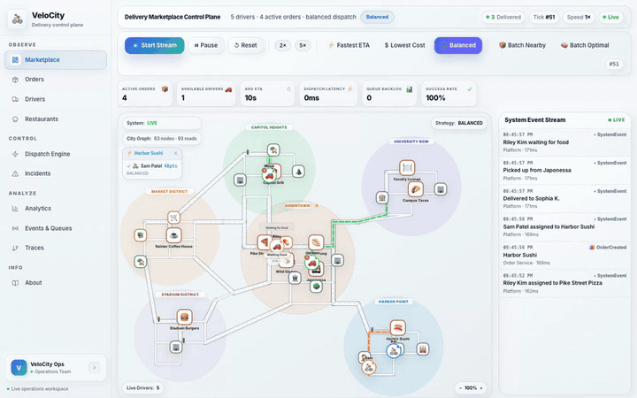
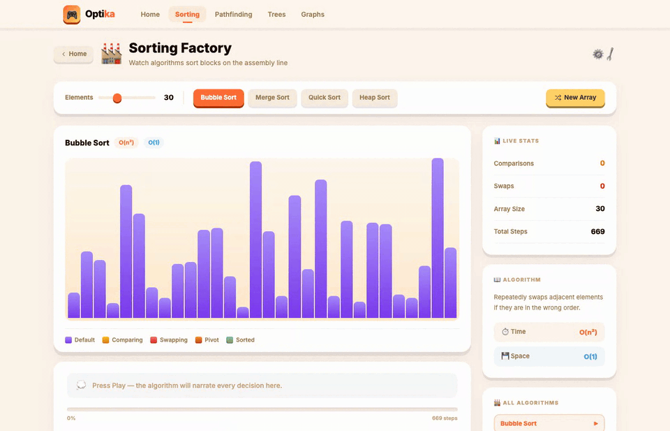

<!--
  Sumeet Suryawanshi — GitHub profile README
  Theme: real-time systems, control planes, and full-stack products.
  Pins + contribution graph render below this README.
-->

  

  

---

  <table>
    <tr>
      <td align="center" width="33%"><b>🛰️ Real-time systems</b> tick loops · dispatch · WebSocket ops consoles</td>
      <td align="center" width="33%"><b>🧭 Algorithm worlds</b> sorting · pathfinding · trees & graphs, narrated</td>
      <td align="center" width="33%"><b>🎨 Full-stack products</b> Spring + React apps shipped end to end</td>
    </tr>
  </table>

## ✦ Featured Projects

<h3>🛰️ VeloCity — real-time courier control plane</h3>

A live dispatch simulator: a server-side <b>tick loop</b> drives couriers across a city, pluggable <b>dispatch strategies</b> assign orders, and a <b>WebSocket ops console</b> streams the whole thing so you can watch the system breathe.

<b>TypeScript · WebSockets · event-driven</b>

<a href="https://github.com/IMSUMEET/velocity"><b>Explore the repo →</b></a>

 

<table>
  <tr>
    <td width="50%" valign="top" align="center">
      
       
      <h3>🧭 Optika</h3>
      Interactive algorithm worlds — sorting, pathfinding, trees and graphs with step-by-step narration you can actually <i>see</i>.
        
      <b>TypeScript · React · visualization</b>
       
      <a href="https://imsumeet.github.io/optika/">live</a> ·
      <a href="https://github.com/IMSUMEET/optika">repo</a>
    </td>
    <td width="50%" valign="top" align="center">
      
       
      <h3>🎨 Portfolio</h3>
      A One Piece–themed personal site — custom cursors, hand-built scenes, and shipped work, all in one playful voyage.
        
      <b>React · JavaScript · motion design</b>
       
      <a href="https://imsumeet.github.io/Portfolio/">live</a> ·
      <a href="https://github.com/IMSUMEET/Portfolio">repo</a>
    </td>
  </tr>
</table>

## ✦ Toolbox

  

## ✦ By the numbers

  

  
  

---

  
    Real-time systems, control planes &amp; full-stack products — <a href="mailto:s.l.suryawanshi4@gmail.com">s.l.suryawanshi4@gmail.com</a>
     
    ↓ pinned repositories &amp; contribution graph below ↓
  

